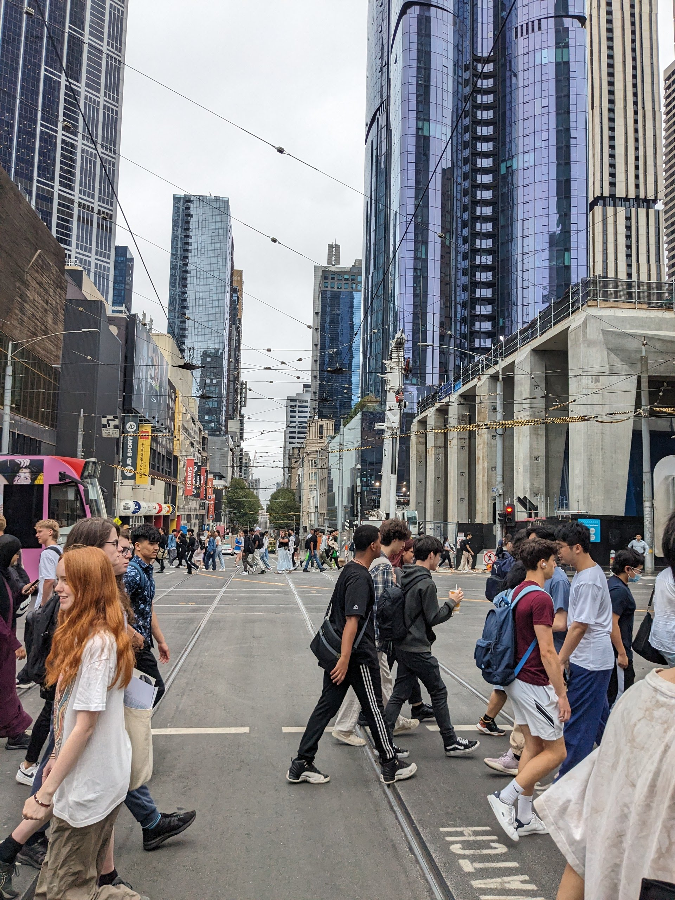
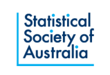
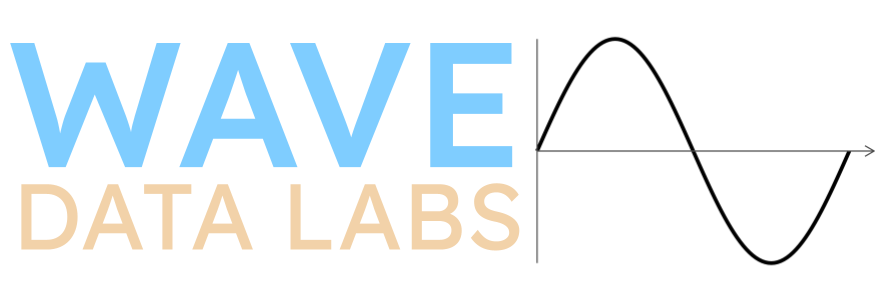

:::: {.columns}

::: {.column width="60%"}

We are excited to announce the next OceaniaR event. This event is run by the Statistical Computing and Visualisation Section of the Statistical Society of Australia. It's an interactive development day and a
chance to collaborate and hack in-person on R-focused projects for social good, with some
of the leading developers in the R community. There will also be time to hold informal talks to share ideas, concepts and new packages for feedback.   

This event will have a focus on promoting projects and participation from R users in the Oceania region including Australia, New Zealand and the Pacific Islands. 

:::

::: {.column width="5%"}

:::

::: {.column width="30%"}
{fig-align="right"}
:::

::::

## Join Us  

To register visit: [https://statsoc.org.au/event-6818002 ](https://statsoc.org.au/event-6818002)

We encourage participation from diverse and underrepresented groups. To ensure a safe, enjoyable, and friendly experience for everyone who participates, we follow a [code of conduct](https://github.com/StatSocAus/oceaniar-2026/blob/main/CODEOFCONDUCT.md).

## When 

Sunday 29th November 2026. 9:00am - 4:00pm. In-person only.

*This is the day before the [Workshop Organised by the Monash Business Analytics Team (WOMBAT) conference](https://wombat2026.numbat.space/).*

## Get Involved  

All project ideas for this event are created by attendees!  

All participants are encouraged to put forward and idea to work on. These will be listed as [Issues](https://github.com/StatSocAus/oceaniar-2026/issues) on the project Github and the working groups will be decided on the day.  

[Submit your idea here ](https://github.com/StatSocAus/oceaniar-2026/issues)

[See examples of past ideas here](https://github.com/StatSocAus/oceaniar-hack-2025/issues)

## The Venue   

Monash College City Campus, 750 Collins St, Docklands, Melbourne VIC 3008

<iframe src="https://www.google.com/maps/embed?pb=!1m18!1m12!1m3!1d3151.7203578601047!2d144.94673457588556!3d-37.820018571974025!2m3!1f0!2f0!3f0!3m2!1i1024!2i768!4f13.1!3m3!1m2!1s0x6ad65d4dbf52da3d%3A0xe25a5625211a931e!2sMonash%20College%20City%20Campus!5e0!3m2!1sen!2sau!4v1723097441393!5m2!1sen!2sau" width="600" height="450" style="border:0;" allowfullscreen="" loading="lazy" referrerpolicy="no-referrer-when-downgrade"></iframe>   

## Sponsors   

[{width=20%}](https://www.statsoc.org.au/)

[{width=20%}](https://www.monash.edu/)

[{width=20%}](https://www.wavedatalabs.com.au/)

Naming credit for OceaniaR to Miles McBain :)  

## Questions  

If you have a question, please file an [Issue here](https://github.com/StatSocAus/oceaniar-2026/issues)  

